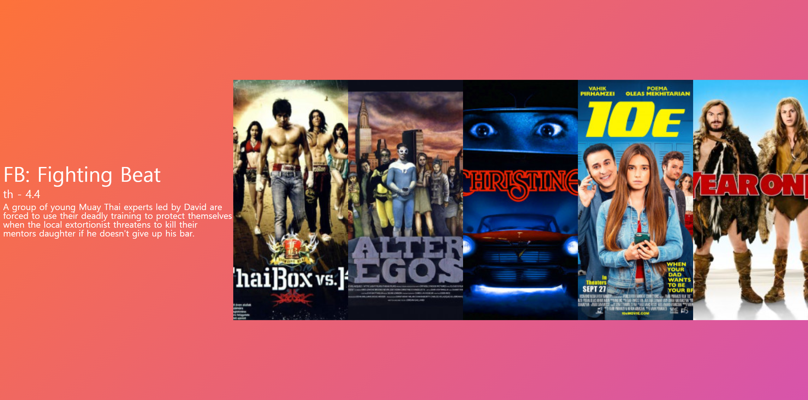

# GraphQL Movie API Frontend

> reset CSS적용 이유와 적용방법중 하나를 학습

    https://cssreset.com/scripts/eric-meyer-reset-css/

> yts API를 사용한 backend로부터 @apollo/clien와 graphql을 사용하여 데이터를 받아오는 방법 학습 
> styled-component 사용방법 학습 
> react-router-dom" 사용방법 학습 
> graphql을 사용하여 클라이언트쪽 global state 관리 방법 학습 
> GraphQL-Movie-APi-Backend랑 연결 

### 구현 동작

